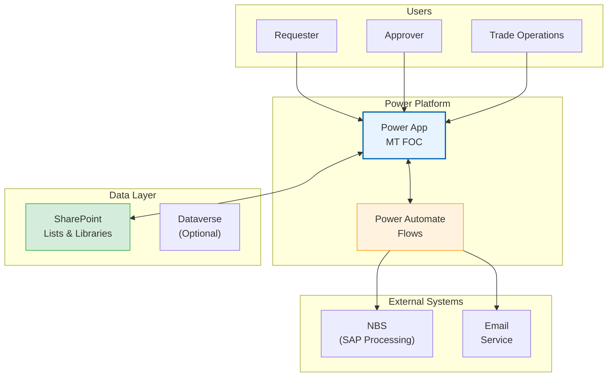
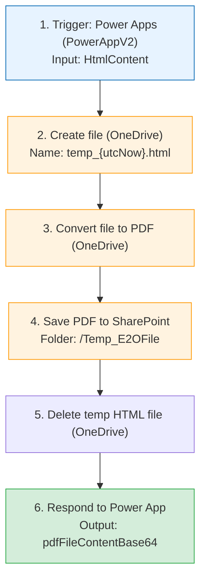
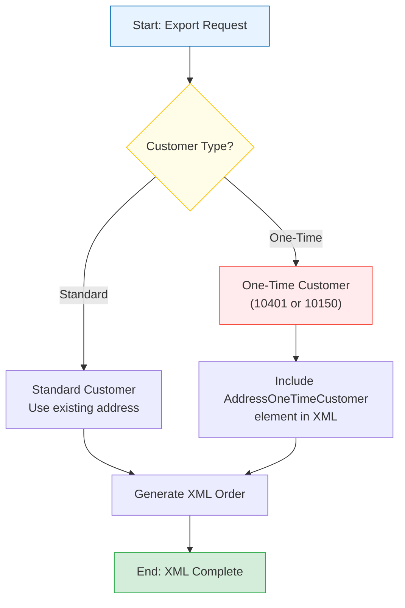
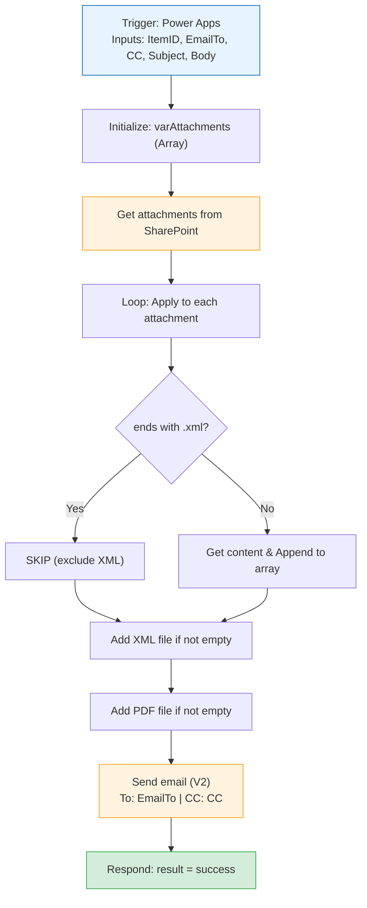

# Mermaid Diagram Guide

This guide explains how to create professional flowcharts and diagrams using Mermaid for documentation.

---

## Overview

Mermaid is a JavaScript-based diagramming tool that generates diagrams from text definitions. We use it to create:
- System architecture diagrams
- Workflow flowcharts
- Process flows
- Power Automate flow visualizations

## Installation

### Prerequisites
```powershell
# Install Node.js (if not installed)
winget install OpenJS.NodeJS

# Install Mermaid CLI globally
npm install -g @mermaid-js/mermaid-cli

# Verify installation
mmdc --version
```

## File Organization

```
project/
├── diagrams/
│   ├── mermaid-config.json      # Styling configuration
│   ├── regenerate.ps1           # Batch regeneration script
│   ├── fig-1-1-system-arch.mmd  # Diagram source files
│   ├── fig-1-1-system-arch.png  # Generated images
│   └── ...
```

### Naming Convention
```
fig-[section]-[number]-[description].mmd

Examples:
fig-1-1-system-architecture.mmd
fig-3-1-main-workflow.mmd
fig-5-2-get-excel-data.mmd
```

---

## Mermaid Configuration

Create `mermaid-config.json` for consistent styling:

```json
{
  "theme": "base",
  "themeVariables": {
    "primaryColor": "#e7f3ff",
    "primaryTextColor": "#333333",
    "primaryBorderColor": "#0066b3",
    "lineColor": "#666666",
    "secondaryColor": "#fff3e0",
    "tertiaryColor": "#ffffff",
    "fontFamily": "Open Sans, Arial, sans-serif",
    "fontSize": "14px"
  },
  "flowchart": {
    "curve": "basis",
    "padding": 20,
    "nodeSpacing": 50,
    "rankSpacing": 50,
    "htmlLabels": true,
    "useMaxWidth": true
  }
}
```

---

## Diagram Types & Examples

### 1. System Architecture (Top-Down)



**Source file: `fig-1-1-system-architecture.mmd`**

### 2. Workflow Flowchart (Linear)



**Source file: `fig-5-4-th-convert-pdf.mmd`**

### 3. Decision Flowchart (with Branches)



### 4. Complex Flow with Loop



---

## Styling Reference

### Standard Color Palette

| Purpose | Fill Color | Border Color | Usage |
|---------|------------|--------------|-------|
| Start/Trigger | `#e7f3ff` | `#0066b3` | Power Apps trigger, start nodes |
| Process/Action | `#fff3e0` | `#ff9800` | SharePoint, OneDrive, Flow actions |
| End/Success | `#d4edda` | `#28a745` | Final response, success states |
| Decision | `#fffde7` | `#ffc107` | Condition nodes |
| Error/Special | `#ffebee` | `#f44336` | Error handling, special cases |
| Neutral | `#f5f5f5` | `#9e9e9e` | General nodes |

### Style Syntax
```mermaid
style NodeID fill:#hexcolor,stroke:#hexcolor,stroke-width:2px
```

### Node Shapes
```
[Text]           Rectangle (default)
(Text)           Rounded rectangle
{Text}           Diamond (decision)
([Text])         Stadium shape
[[Text]]         Subroutine
[(Text)]         Cylinder (database)
((Text))         Circle
>Text]           Flag
```

---

## Generation Commands

### Single Diagram
```powershell
mmdc -i diagram.mmd -o diagram.png -c mermaid-config.json -s 3 -b white
```

**Parameters:**
- `-i` : Input file (.mmd)
- `-o` : Output file (.png, .svg, .pdf)
- `-c` : Config file (mermaid-config.json)
- `-s 3` : Scale factor (3x for high DPI)
- `-b white` : Background color

### Batch Regeneration Script

Create `regenerate.ps1`:

```powershell
$configPath = "mermaid-config.json"
$diagrams = @(
    "fig-1-1-system-architecture",
    "fig-3-1-workflow",
    "fig-3-2-auto-ref-sheet",
    "fig-5-1-export-file",
    "fig-5-2-get-exceldata"
)

Set-Location $PSScriptRoot

foreach ($name in $diagrams) {
    Write-Host "Generating $name.png..."
    & mmdc -i "$name.mmd" -o "$name.png" -c $configPath -s 3 -b white
}

Write-Host "Done!"
```

**Run:**
```powershell
powershell -ExecutionPolicy Bypass -File "diagrams/regenerate.ps1"
```

---

## HTML Integration

### CSS Classes for Diagram Sizing

```css
/* Long flowcharts (5+ steps vertical) */
.flow-diagram-long {
    width: 100%;
    max-height: 7.5in;
    object-fit: contain;
    display: block;
    margin: 0 auto;
}

/* Short flowcharts (3-4 steps) */
.flow-diagram-short {
    width: 100%;
    max-height: 4in;
    object-fit: contain;
    display: block;
    margin: 0 auto;
}

/* Architecture diagrams (wide) */
.arch-diagram {
    width: 100%;
    max-height: 5in;
    object-fit: contain;
    display: block;
    margin: 0 auto;
}
```

### HTML Usage

```html
<figure>
    
    <figcaption>Figure 3-1: Main Application Workflow</figcaption>
</figure>
```

---

## Best Practices

### 1. Keep Diagrams Focused
- One concept per diagram
- Maximum 10-12 nodes for readability
- Split complex flows into sub-diagrams

### 2. Use Consistent Styling
- Always use the color palette
- Apply styles to node types consistently
- Use same config file for all diagrams

### 3. Label Clearly
- Number steps in sequence flows
- Include key details in node text
- Use `<br/>` for multi-line text

### 4. Test Before Finalizing
- Generate PNG and check in image viewer
- Test in actual PDF output
- Verify text is readable at print size

### 5. Document Generation
- Keep .mmd source files in version control
- Regenerate all diagrams when config changes
- Include generation script in project

---

## Troubleshooting

### Problem: Text is cut off
**Solution:** Increase node spacing in config or use shorter text

### Problem: Diagram too small in PDF
**Solution:** Use `-s 3` or higher scale factor when generating

### Problem: Colors not applying
**Solution:** Check style syntax - node ID must match exactly

### Problem: mmdc command not found
**Solution:** Ensure Node.js bin folder is in PATH, restart terminal

### Problem: Lines crossing awkwardly
**Solution:** Reorder node definitions or use subgraphs to group related nodes

---

## Quick Reference Card

```
# Basic flow
flowchart TD
    A[Start] --> B[Process] --> C[End]

# Decision
B --> D{Condition?}
D -->|Yes| E[Path 1]
D -->|No| F[Path 2]

# Style
style A fill:#e7f3ff,stroke:#0066b3

# Subgraph
subgraph GroupName["Label"]
    Node1
    Node2
end

# Generate
mmdc -i input.mmd -o output.png -c config.json -s 3 -b white
```
